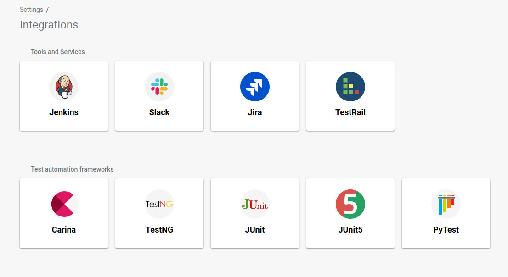
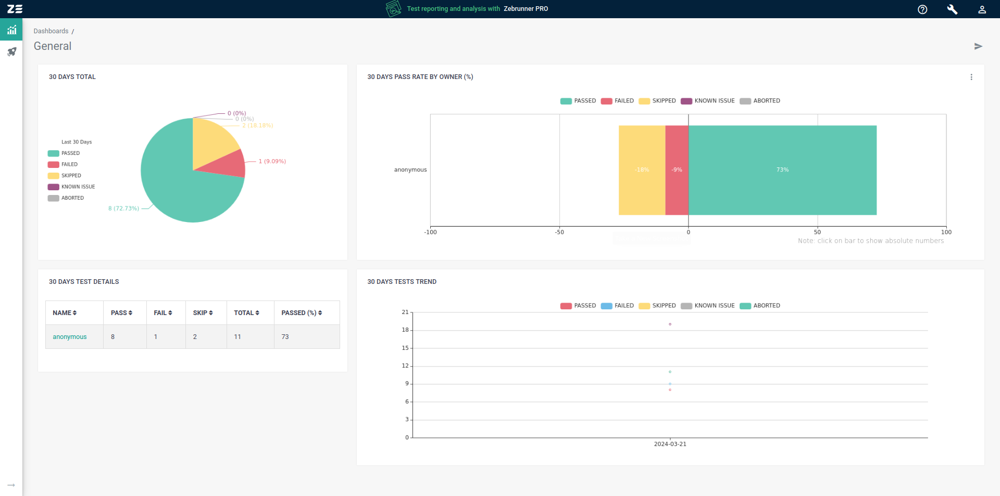

# Graduaatsproef

## Table of Contents

- [Graduaatsproef](#graduaatsproef)
  - [Table of Contents](#table-of-contents)
  - [Taken](#taken)
  - [Research](#research)
    - [Welke opties zijn er?](#welke-opties-zijn-er)
      - [Azure](#azure)
      - [Prometheus/Grafana:](#prometheusgrafana)
      - [ReportPortal:](#reportportal)
      - [Zebrunner](#zebrunner)
      - [integraties](#integraties)
      - [Basic Dashboard](#basic-dashboard)
  - [Bronnen](#bronnen)

##  Taken
 - [x] 3 - 4 Opties verzamelen
 - [ ] POC maken per tool
 - [ ] Screenshots invoegen
 - [ ] Pros & cons beschrijven

## Research

### Welke opties zijn er?

#### Azure
Vendor lockin en weinig tot geen customization. 

#### Prometheus/Grafana:
Dient eerder voor logs en constante data op te slaan, de resultaten moeten als XML worden opgeslagen en worden uitgelezen. 
De werking is vrij simpel, het meeste werkt out of the box, er moet enkel een script worden geschreven. 
Dit script gaat na het beeindigen van een testrun de resultaten uploaden naar een cloud opslag. 
Deze opslag wordt dan gebruikt door prometheus om de resultaten in een database te steken die gelezen en doorzocht kan worden door een dashboard.

#### ReportPortal:
Complex en groot, maar doet wel wat we we er van vragen.
Dit is een docker-compose stack die speciaal gemaakt is voor het visualiseren van test resultaten. 
De hele stack bestaat uit een dashboard, een database, authenticatie, rabbitmq en verschillende services voor health en metrics te bekijken.

https://reportportal.io/docs/log-data-in-reportportal/ImportDataToReportPortal#import-via-api

#### Zebrunner
Configuratie gaat via bash script. Provisoning is niet echt ondersteund. Dit zouden we moeten doen door dingen in de database aan te passen. Ook geeft de community edition weinig opties in vergelijking met andere platformen. (geen integratie met Azure/Ctest en het python unittest famework). Wel een user interface die overzichtelijk is en minimalistisch.

#### integraties

#### Basic Dashboard

## Bronnen

[Grafana docs](#https://grafana.com/docs/grafana/latest/)

[ReportPortal docs](#https://reportportal.io/docs/)

[Zebrunner docs](#https://zebrunner.com/documentation/)

[Automated Test Results: how to track and visualize them](#https://www.solvd.com/blog/automated-test-results-visualization)

[Core Definitions](#https://zebrunner.com/documentation/guide/)
